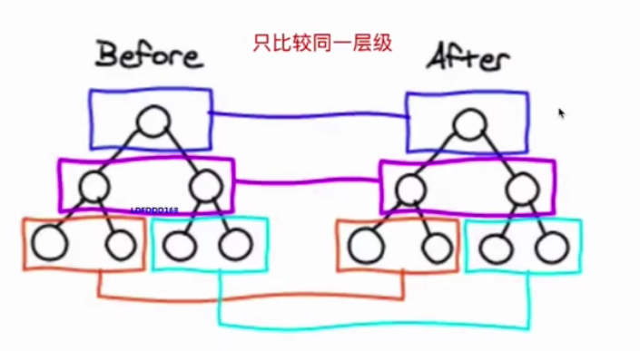
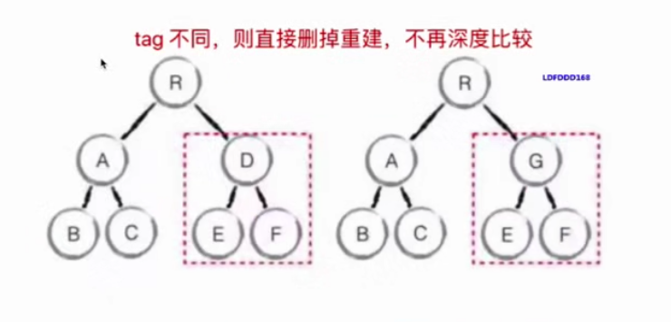

### 深入响应式原理
- 1、检测其中1个值是否发生变化(Proxy)
- 2、用跟踪 (track) 函数修改值: proxy 中的 getter 中执行此操作，称为 effect
- 3、用触发 (trigger) 函数更新为最新的值: 在 proxy 中的 setter 中进行该操作，名为 trigger

### Diff启发式算法O(n)优化
- 1、只比较同一层级，不做跨级比较

- 2、tag不同，则直接删掉重建，不再深度比较。(两个不同类型的元素会产生出不同的树)

- 3、tag和key, 两者都相同，则认为是相同节点，不再做深度比较

说明：开发者可以通过设置 key 属性，来告知渲染哪些子元素在不同的渲染下可以保存不变